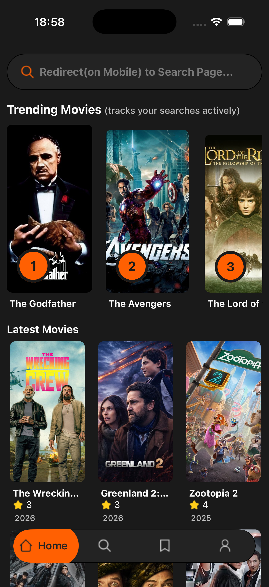
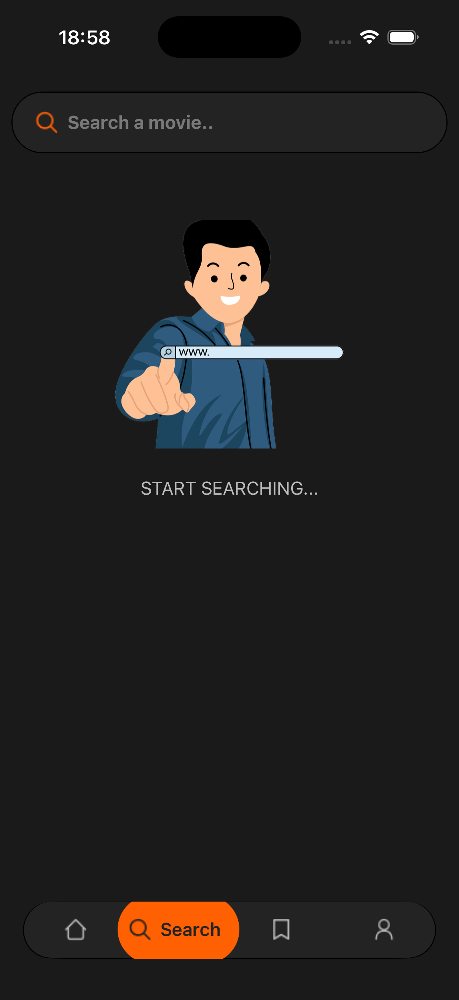
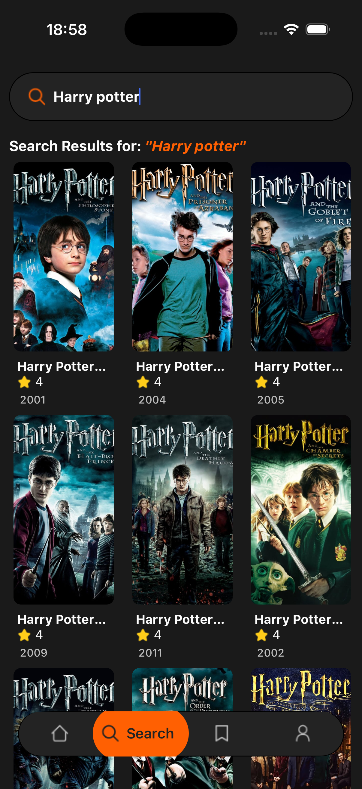

# React Native Expo - Movie App 👋

Built with Expo and TypeScript, this app fetches movies and creates a popularity algorithm using Appwrite. It provides users with a seamless browsing experience, ranking movies based on various engagement metrics.

💻 **Try the app in your browser:** [Live Demo](https://movie-app-berk.netlify.app)

## Features

- **Cross platform mobile app**: supports both ios and android(backend supports ios only)
- **Real-time data**: Fetching and displaying real-time movie data
- **Home Page**: Featured and discover movies
- **Search Page**: Search for your favorite movies
- **Popularity algorithm**: Track user searches to display the most popular movies

## Screenshots

<!--  -->

<div style="display: flex; gap: 10px;">

  
  
  

</div>

## Get started

### Prerequisites 🛠️

Make sure you have the following installed on your machine:

- [Git](https://git-scm.com/)

- [Node.js](https://nodejs.org/en)

- [npm](https://www.npmjs.com/) (Node Package Manager)

### Installation 📦

1. **Clone the repository:**

   ```bash
   git clone https://github.com/berkgirgin/RN_Movie_App.git
   ```

2. **Change into the project directory:**

   ```bash
   cd basic_RN_Movie_App
   ```

3. **Install dependencies:**

   ```bash
   npm install
   ```

4. **Set Up Environment Variables**

   Create a new file named `.env` in the root of your project and add the following content:

   ```env

   EXPO_PUBLIC_MOVIE_API_KEY=

   EXPO_PUBLIC_APPWRITE_PROJECT_ID=

   EXPO_PUBLIC_APPWRITE_DATABASE_ID=

   EXPO_PUBLIC_APPWRITE_COLLECTION_ID=
   ```

   Replace the placeholder values with your actual TMDB API key, Appwrite project ID, Database ID, and Collection ID. You can obtain these credentials by signing up on the [Appwrite](https://jsm.dev/rn25-appwrite), [TMDB](https://www.themoviedb.org/login).

### Running the App(in Expo) ▶️

```bash
npm start
```

In the output, you'll find options to open the app in:

- Press a │ open Android
- Press i │ open iOS simulator
- Press w │ open web
